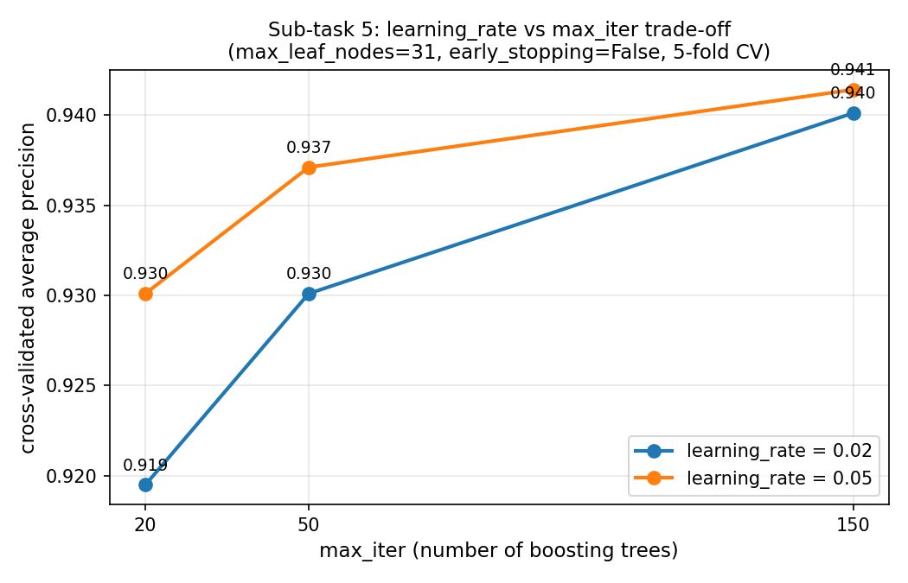

## Sub-task 5 — Gradient boosting: learning rate vs. number of trees

**Model:** `HistGradientBoostingClassifier` · **Metric:** average precision (5-fold CV) · **Data:** UNSW-NB15, 20,000 flows, 10% attack rate

| `learning_rate` | `max_iter` (trees) | `max_leaf_nodes` | CV average precision |
|---:|---:|---:|---:|
| 0.05 | 300 | 15 | **0.9413** ← best |
| 0.10 | 100 | 15 | 0.9406 |
| 0.05 | 100 | 15 | 0.9404 |
| 0.10 | 100 | 31 | 0.9398 |
| 0.20 | 100 | 15 | 0.9387 |
| 0.20 | 100 | 31 | 0.9355 |

**Best setting:** `learning_rate=0.05, max_iter=300, max_leaf_nodes=15` → **AP = 0.9413** (held-out test: 0.9437).

**Reading.** The trade-off is the gap between the two lines: at 20 trees, the smaller learning rate (0.02) trails the larger one (0.05) by a full point of AP, because shrinkage that small hasn't had time to build up enough signal yet. By 150 trees the gap has closed to under 0.002 — the smaller learning rate caught up by adding the trees it needed, while the larger one had already plateaued. This is the trade in one picture: a lower learning rate generalises at least as well, but only pays off once `max_iter` is raised to give it room.
